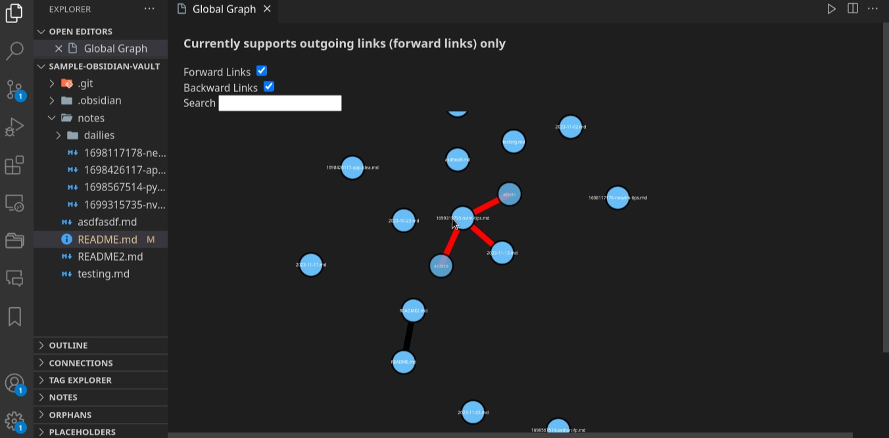
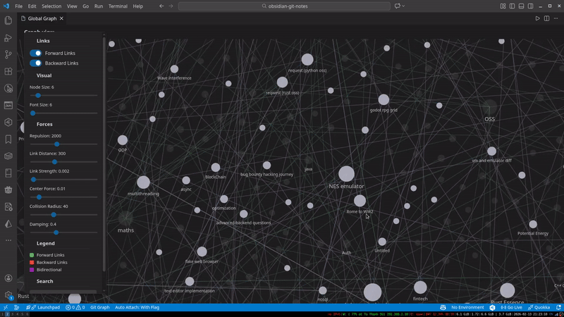

# obsidian-visualizer  
 
Providing core obsidian features in VSCode: graphs, backlinks,...

VSCode marketplace: [Obsidian Visualizer](https://marketplace.visualstudio.com/items?itemName=khuongduy354.obsidian-visualizer)
<!-- 

 -->




# Usage  
Install the extension, it will read workspace on startup. After intial read, you can view global graph, local graph  

If graphs doesn't rendered as intended: Command Pallete > Force workspace parse 


## Features 

- Local graph: open a markdown file, Command Pallete > Show Local Graph 
- Global graph: Command Pallette > Show Global graph 
- Force reparse: Command Pallette > Force workspace parse
- Link resolve given a filename or a path
- **Autocomplete**: Type `[[` or `](` to get file suggestions
- **Ctrl+Click**: Navigate to linked files by Ctrl/Cmd+Click on `[[link]]` or `[](link)`
- GUI
    - double click on node to open file
    - **smart hover**: highlights connected nodes and edges when hovering
    - toggle forward links, backlinks
    - **directional arrows**: green (forward), red (backward), purple (bidirectional)
    - showing non-exist files (as blurred)
    - **auto-refresh** when files or settings change
    - **smooth interactions**: drag nodes, zoom/pan, optimized for large vaults
- Search (global graph only) 
    - filename: <keyword>          (starts search with filename:)
    - path: <keyword>              (starts search with path:)

**Note**: it will included all markdown files recursively starting from the root directory of current workspace, multiple workspace not supported


## Configuration 

### Graph Visualization

The graph view includes interactive controls in the UI panel to adjust:

**Visual Settings:**
- Node Size (2-50): Base node radius. Nodes scale with connection count
- Font Size (6-30): Base label text size. Labels show/hide based on zoom level

**Force Simulation:**
- Repulsion (100-5000): How much nodes push apart
- Link Distance (30-800): Ideal distance between connected nodes
- Link Strength (0.001-0.1): How strongly links pull nodes together
- Center Force (0-0.1): Gravity toward center
- Collision Radius (10-100): Prevents node overlap
- Damping (0.1-0.9): Friction/settling speed

**Tip for large vaults:** Increase Repulsion and Link Distance to reduce clutter. Adjust settings live while viewing the graph!

You can also set default values in VSCode settings (`obsidianVisualizer.graph.*`).

### File Filtering

- `include`: Glob patterns for files to include (empty = all files)
- `exclude`: Glob patterns to exclude (default: `node_modules`, hidden folders)
- `linkPattern`: Parse `obsidian` `[[...]]`, `markdown` `[](...)`, or `both`


## Run from source 
### Web 
```js 
npm run watch-web  
npm run run-in-browser //another terminal 
``` 

### VSCode Desktop (run from VSCode)
Press F5 or  Command Pallete >Debug: Start Debugging 


## Release Notes 

### 1.1.5

- Obsidian-like clean visual style (muted links, soft nodes)
- Zoom-based label visibility (less clutter)
- Connection-based node scaling (more links = bigger node)
- More generous default spacing for dense vaults

### 1.1.4

**Major UI Overhaul:**
- Custom D3 graph renderer (replaced neo4jd3) for better performance
- Directional arrows on links showing link direction
- Smart hover highlighting: connected nodes and edges light up
- Ctrl+Click navigation: Navigate to files by clicking links in markdown
- Optimized force simulation: no more bouncing nodes in large vaults
- Smooth animations and interactions (drag, zoom, pan)

**Performance:**
- Better handling of large vaults (100+ files)
- Stable graph layout with auto-stabilization
- Reduced memory usage

### 1.1.3

**New Features:**
- Link autocomplete: Type `[[` or `](` to get file suggestions
- Colored links: forward (green), backward (red), bidirectional (purple)
- Auto-refresh: Graph updates automatically when files or exclude/include settings change

**Bug Fixes:**
- Fixed resource leaks in file watchers and event listeners
- Fixed link color rendering in global graph
- Fixed backlinks data corruption on file updates
- Performance improvements (eliminated duplicate graph parsing)

### 1.1.2    

- Add more notifications 

* Fix bugs: 
- Searching filter out nodes in relationship with result nodes, that is not part of the results. 
- Empty files (which was skipped in previous versions) is now tracked.
- Virtual nodes now has a undefined (null-ish) uri instead of a placeholder like before 


### 1.1.1 
 
- Remove relative links 
- Fix text display in virtual file 
- Fix graph reparse on events bug 

### 1.1.0 

- Desktop supports 

### 1.0.0

- Initial release of obsidian visualizer
- Local & Global graph rendering.
- Decent GUI: toggle links, highlightings nodes
- Search with filename and path
- Only for web version
