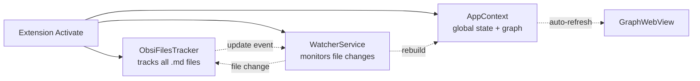
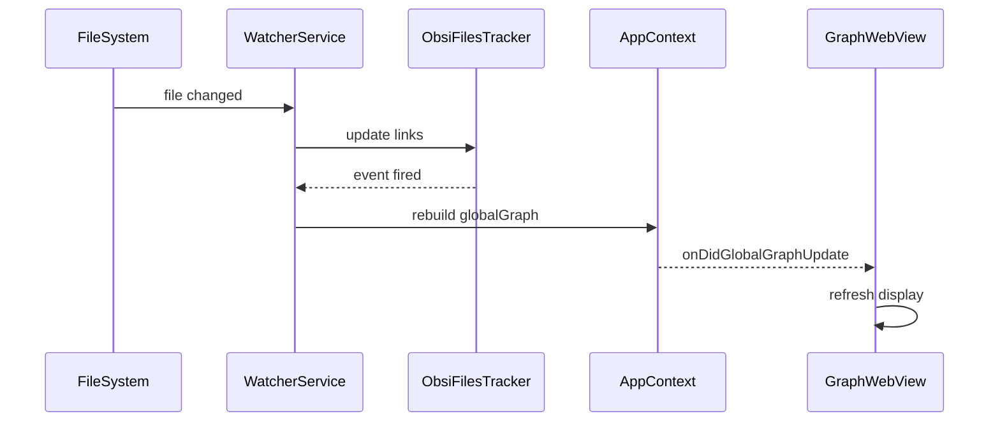

# now      
- FIXING BUGS 
filter apply on forwardlinks/backwardslink toggle also 
(move graph options into appstate) 


##### 

- events in web(production) not worked: probably due to web 
- delete events untested

- lag when large connected node
-> connection force too strong 

- events in Desktop worked: 
-> add auto rerendering graph webview 


 
4. testing  # especially on links parse   


4. Attachments handling 
-> parse it back (currently ignore ![[...]]) 
-> fix link resolver (move it out of extractForwardLinks)


- performance issue in event???

## plans ahead      
3. Search text in workspaces: grep is not supported in vscode api (stably)

- Included, Excluded folders, Attachment folders   
-> Exclude is a bug in vscode, which works in desktop but not in browser...
7. tiny stuffs 
- text below 
- bolder/bigger with more connections 
- orphans toggle setting 
8. tagging 
3. embed text from link

# Working features  
### on web only 
- Show global graph 
- Show local graph forward links + backwardlinks
- Force reparse 
- Link resolve given a filename
- GUI 
    - highlighted when mouse over a node 
    - toggle forward links
    - showing files despite not exist (as blurred)    
- Search (global graph only)
    - filename: shows nodes + its back/forward links where filename.contains("keyword") 
    - path: shows nodes + its back/forward links where path.contains("keyword")  
    - default: filename    

# backlog 
- bug on desktop version -> link  
- bug initial read -> show read 0 files but when run global graph, it still working  
-> in obsitracker.readallworkspacefiles, use promise.all instead to check for error

# Design   

## Architecture overview



## Event flow



## Data structures
```
ObsiFilesTracker:
  forwardLinks: Map<path, files[]>  // what this file links to
  backLinks: Map<path, files[]>     // what links to this file
  fileNameFullPathMap: Map<name, paths[]>  // filename -> full paths (for resolution)
```

## Link resolver
- given a filename -> resolve full path via fileNameFullPathMap, undefined if not resolveable
- if 2 files same name (different path), pick first (that's how obsidian handles)
- applies for both backlinks and forwardlinks

## Non-exist (virtual) file
- not in forwardLinks keys, only in forwardLinks values
- blurred in graph, given an id = its path (no collision since file doesn't exist as a key)

## Disposal chain
```
extension deactivate
  -> context.subscriptions dispose all:
     -> WatcherService.dispose (timers + fsWatcher + event subs)
     -> ObsiFilesTracker.dispose (configListener + event emitters)
     -> AppContext.dispose (onDidGlobalGraphUpdate emitter)
  -> GraphWebView panel.onDidDispose (global graph event subscription)
```

## Cross-Platform
URIHandler detects workspace scheme (vscode-test-web, file, vscode-vfs, http) and constructs proper URIs.
GraphCreator only works on file paths, independent of URI scheme.

### URI formats
- web: path is relative, append to base (vscode-test-web://mount/)
- desktop: path is absolute (/home/.../vault), no appending needed

